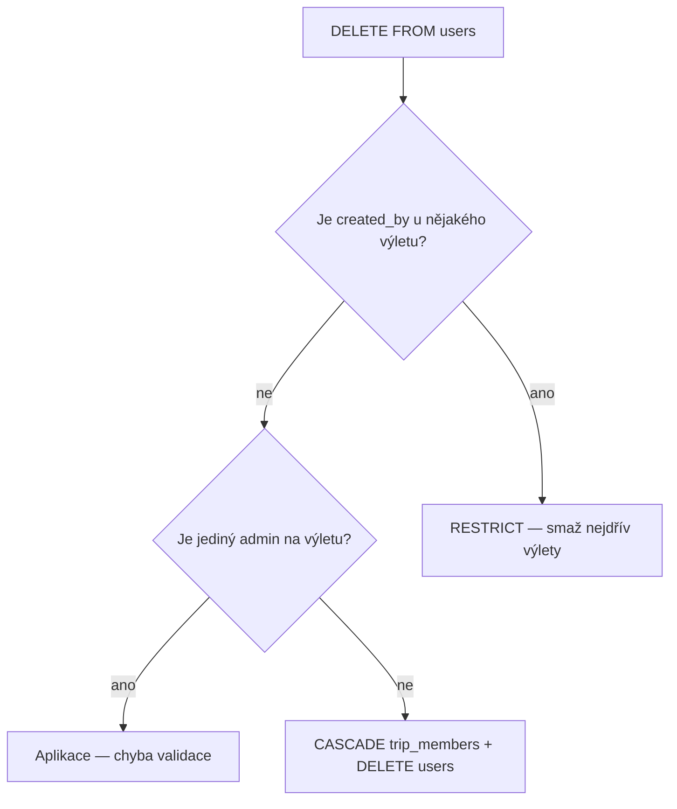

# Users & trips

[← Přehled schématu](README.md)

## Tabulky

### `users`

| Sloupec | Typ | Popis |
|---|---|---|
| `id` | UUID, PK | |
| `email` | VARCHAR, UNIQUE, NOT NULL | |
| `first_name` | VARCHAR | |
| `last_name` | VARCHAR | |
| `display_name` | VARCHAR | |
| `avatar_url` | TEXT | |
| `timezone` | VARCHAR, NOT NULL | Výchozí `UTC` |
| `locale` | VARCHAR, NOT NULL | Výchozí `en` |
| `unit_system` | unit_system, NOT NULL | Systém jednotek pro zobrazení (`metric` / `imperial`); výchozí `metric`. Editovatelné v profilu / settings. Nekopíruje se na `trips` — každý prohlížeč vidí podle svého nastavení. Viz [Jednotky zobrazení](#jednotky-zobrazení) |
| `home_currency` | CHAR(3), NOT NULL | Výchozí plánovací měna uživatele (ISO 4217 uppercase); při vytvoření výletu se zkopíruje do `trips.home_currency`; výchozí `USD` |
| `home_country_code` | CHAR(2), nullable | Domácí země uživatele (ISO 3166-1 alpha-2); `NULL` = neznámé. FE používá pro automatickou nápovědu zásuvek / adaptéru — viz [Electrical standards](electrical-standards.md); budoucí auto formality (pas/vízum) — viz [Travel requirements](travel-requirements.md) |
| `created_at` | TIMESTAMPTZ | Výchozí `now()` |
| `updated_at` | TIMESTAMPTZ | Výchozí `now()`; Auto-trigger |

#### Jednotky zobrazení

DB a API ukládají a vrací **vždy kanonické SI** hodnoty. Preferenci `unit_system` čte FE a **veškeré přepočty i formátování** provádí klient — BE nepřepočítává, neformátuje labely a nevrací paralelní hodnoty (°F, mi, mph, in).

| Kanon v DB / API | `metric` (FE) | `imperial` (FE) |
|---|---|---|
| metry (`*_meters`, `visibility_avg_m`) | `< 1000 m` → celé m; jinak km (1 desetina) | `< 0.1 mi` → celé ft; jinak mi (1 desetina) |
| °C (`*_c` — vzduch, pocitová, SST) | °C (1 desetina) | °F (`°C × 9/5 + 32`) |
| m/s (`wind_speed_*_ms`) | m/s (1 desetina) | mph (`m/s / 0.44704`) |
| mm (`rain_mm`) | mm | in (`mm / 25.4`) |

Konstanty: `1 mi = 1609.344 m`, `1 ft = 0.3048 m`, `1 mph = 0.44704 m/s`, `1 in = 25.4 mm`. Bez přepočtu: `%` vlhkost, směr větru ve stupních, hodiny slunce, enum síly větru / mlhy / oblačnosti.

Katalogové filtry, prahy v `clothing_rules` a robotaxi advisories zůstávají v kanonu (°C, m, m/s, mm). FE může UI filtru ukázat v preferované jednotce, ale na API pošle SI.

### `trips`

| Sloupec | Typ | Popis |
|---|---|---|
| `id` | UUID, PK | |
| `created_by` | UUID, FK → users | ON DELETE RESTRICT. **Neměnný** auditní záznam původního tvůrce — žádný UPDATE (aplikace zakazuje, DB nemá trigger ani CHECK). Slouží výhradně pro audit a dotazy na autora; **nepřidává** automaticky oprávnění — přístup vždy jen přes `trip_members`. Tvůrce je při vytvoření vždy `admin` v téže transakci jako INSERT do `trips`. Převod `created_by` na jiného uživatele neexistuje. |
| `title` | VARCHAR, NOT NULL | Název výletu v jazyce autora (autorský obsah, ne systémový překlad) |
| `description` | TEXT, nullable | Autorský popis výletu v jazyce autora (autorský obsah, ne systémový překlad) |
| `cover_image_url` | TEXT, nullable | URL náhledového obrázku pro katalog a detail |
| `status` | trip_status | Výchozí `draft`; `published` = hotový výlet viditelný dle `visibility` |
| `visibility` | trip_visibility | Výchozí `private`; bezpečnostní hranice čtení. `private` = jen členové, `unlisted` = čitelné přes přímý UUID odkaz, `public` = katalogově viditelné při `status = published` |
| `home_currency` | CHAR(3), NOT NULL | Měna, ve které autor chce výlet plánovat a zobrazovat rozpočet (ISO 4217 uppercase); editovatelná na detailu výletu; při vytvoření výletu výchozí z `users.home_currency`; výchozí `USD` |
| `party_size` | SMALLINT, NOT NULL | Pro kolik lidí je výlet plánovaný; editovatelná na detailu výletu; `>= 1`; výchozí `1`. **Není** počet členů v `trip_members` ani `passenger_count` u robotaxi úseku — viz [Velikost skupiny](#velikost-skupiny) |
| `total_cost_usd` | NUMERIC(10, 2) | Agregovaná cena v USD; cache odvozená ze segmentů (`SUM price_usd`); kanon pro veřejný katalog a filtrování napříč výlety; ne ručně editovatelná; výchozí `0` |
| `total_cost_home` | NUMERIC(10, 2) | Agregovaná cena v `home_currency`; cache odvozená ze segmentů (`SUM home_price_amount`); pro rozpočet a zobrazení výletu autorovi; ne ručně editovatelná; výchozí `0` |
| `total_duration_minutes` | INTEGER | Předpočítaná délka aktivit a dopravy v minutách (bez ubytování); cache odvozená ze segmentů, ne ručně editovatelná; výchozí `0`. **Není** doba dojezdu z výchozího místa — viz `destination_place_id` / filtr dojezdu |
| `destination_place_id` | UUID, FK → places, nullable | Cache destinace výletu (`places.id`); odvozená ze segmentů, ne ručně editovatelná; `NULL` = destinaci nelze určit — výlet neprojde filtrem dojezdu. ON DELETE SET NULL; před DELETE místa musí aplikace připravit celý pár s `outbound_transport_mode`, viz [mazání výletů a míst](#mazání-výletu) |
| `outbound_transport_mode` | transport_mode, nullable | Cache režimu dopravy „jak se tam dostanu“ z itineráře; párový s `destination_place_id` (obě NOT NULL nebo obě NULL). Pravidla odvození — viz [Cache destinace a outbound režimu](travel-times.md#cache-destinace-a-outbound-režimu-na-trips) |
| `recommended_age_min` | SMALLINT, nullable | Nejvyšší minimální věk mezi aktivitami — `MAX(segments.recommended_age_min)` přes `segment_kind = activity` (`NULL` = bez spodní hranice); cache odvozená ze segmentů, ne ručně editovatelná |
| `recommended_age_max` | SMALLINT, nullable | Nejpřísnější horní hranice věku mezi aktivitami — `MIN(segments.recommended_age_max)` přes `segment_kind = activity` (`NULL` = bez horní hranice); cache odvozená ze segmentů, ne ručně editovatelná |
| `max_difficulty` | segment_difficulty, nullable | Agregovaná nejvyšší náročnost z aktivit; cache odvozená ze segmentů, ne ručně editovatelná; `NULL` = žádná aktivita s náročností — ve filtrovaném katalogu dle náročnosti se nezobrazí |
| `temp_min_c` | NUMERIC(4, 1), nullable | Agregovaná nejnižší očekávaná **vzduchová** teplota výletu ve °C; cache z `weather_records` s fallbackem na `weather_climate_months`, ne ručně editovatelná. FE zobrazení dle `users.unit_system` |
| `temp_max_c` | NUMERIC(4, 1), nullable | Agregovaná nejvyšší očekávaná **vzduchová** teplota výletu ve °C; cache z `weather_records` s fallbackem na `weather_climate_months`, ne ručně editovatelná |
| `feels_like_min_c` | NUMERIC(4, 1), nullable | Agregovaná nejnižší očekávaná **pocitová** teplota výletu ve °C; cache z `weather_records` s fallbackem na klima (viz [Pocitová teplota](weather-and-climate.md#pocitová-teplota)); ne ručně editovatelná; primární pro katalogový filtr teploty (filtr vždy ve °C) |
| `feels_like_max_c` | NUMERIC(4, 1), nullable | Agregovaná nejvyšší očekávaná **pocitová** teplota výletu ve °C; cache z `weather_records` s fallbackem na klima; ne ručně editovatelná; primární pro katalogový filtr teploty |
| `temperature_source` | temperature_source, nullable | Odkud teplotní cache pochází: `weather_records` (všechny dotčené týdny měly týdenní záznam, včetně rodičovské oblasti přes [geo-fallback](weather-and-climate.md#hierarchie-oblastí-a-geo-fallback)) nebo `climate` (alespoň jeden se dopočítal z `weather_climate_months`); `NULL` = teplotní cache je prázdná — viz [Fallback na klima](weather-and-climate.md#fallback-na-klima) |
| `water_temp_min_c` | NUMERIC(4, 1), nullable | Agregovaná nejnižší očekávaná teplota **mořské vody** (SST) výletu ve °C; cache z `weather_records` s fallbackem na klima; ne ručně editovatelná; `NULL` = výlet nemá vyřešitelnou SST (vnitrozemí / bez marine bodu) — viz [Teplota mořské vody](weather-and-climate.md#teplota-mořské-vody-sst) |
| `water_temp_max_c` | NUMERIC(4, 1), nullable | Agregovaná nejvyšší očekávaná teplota mořské vody (SST) výletu ve °C; cache z `weather_records` s fallbackem na klima; ne ručně editovatelná |
| `water_temperature_source` | temperature_source, nullable | Odkud SST cache pochází: `weather_records` / `climate` / `NULL` — stejný enum a sémantika jako `temperature_source`, ale jen pro vodu |
| `rating_avg` | NUMERIC(2, 1), nullable | Průměrné uživatelské hodnocení výletu (`1.0`–`5.0`); cache z `trip_reviews.score`; ne ručně editovatelná; `NULL` = žádné recenze (`rating_count = 0`) |
| `rating_count` | INTEGER, NOT NULL | Počet uživatelských recenzí; cache z `trip_reviews`; ne ručně editovatelná; výchozí `0` |
| `packing_computed_at` | TIMESTAMPTZ, nullable | Čas posledního úspěšného přepočtu cache balení (`trip_packing_items`, `segment_packing_items`); `NULL` = cache ještě nebyla spočítána nebo byla invalidována a čeká na job |
| `travel_requirements_computed_at` | TIMESTAMPTZ, nullable | Čas poslední změny cache cestovních požadavků (`trip_travel_requirements`); v1 při ručním add/remove; `NULL` = cache ještě nebyla nastavena |
| `robotaxi_advisories_computed_at` | TIMESTAMPTZ, nullable | Čas posledního úspěšného přepočtu cache robotaxi upozornění (`trip_robotaxi_advisories`, `segment_robotaxi_advisories`); `NULL` = cache ještě nebyla spočítána nebo byla invalidována a čeká na job |
| `created_at` | TIMESTAMPTZ | Výchozí `now()` |
| `updated_at` | TIMESTAMPTZ | Výchozí `now()`; Auto-trigger |

`created_by`, `created_at` a `updated_at` poskytují původ a poslední čas změny, ale nejsou historií kolaborativních editací: neříkají, který člen změnil konkrétní segment nebo hodnotu. V1 nemá trip revisions ani doménový audit log. Jejich budoucí podoba (verze snapshotů, změnové události nebo audit entries) zůstává produktovým rozhodnutím.

### `trip_members`

| Sloupec | Typ | Popis |
|---|---|---|
| `trip_id` | UUID, PK, FK → trips | ON DELETE CASCADE |
| `user_id` | UUID, PK, FK → users | ON DELETE CASCADE |
| `role` | member_role | Výchozí `viewer` |
| `created_at` | TIMESTAMPTZ | Výchozí `now()` |
| `updated_at` | TIMESTAMPTZ | Výchozí `now()`; Auto-trigger |

Při vytvoření výletu aplikace automaticky vloží tvůrce (`trips.created_by`) do `trip_members` s rolí `admin` a nastaví `trips.home_currency` z `users.home_currency` tvůrce (v téže transakci jako INSERT do `trips`). `party_size` výchozí `1`, pokud autor nezadá jinak. Existující admin může jmenovat další adminy; na jednom výletu může být více adminů.

Admin **může** odstranit původního tvůrce z `trip_members`, pokud na výletu zůstane **alespoň jeden jiný admin**. `trips.created_by` zůstává neměnný auditní záznam bez vlivu na přístup. Invariant: na každém výletu musí být v `trip_members` **alespoň jeden admin** — aplikace jej vynucuje zamčeným workflow níže, ne prostým předběžným `COUNT`.

Dotaz „Moje výlety“: `SELECT trip_id FROM trip_members WHERE user_id = :current_user` — bez UNION s `created_by` (tvůrce je vždy v `trip_members` při vytvoření; po odstranění z `trip_members` už výlet nevidí).

#### Race-safe ochrana posledního admina

Invariant „alespoň jeden admin na každém výletu“ je záměrně aplikační, bez DB triggeru. Proto **každý** INSERT/UPDATE/DELETE v `trip_members` musí jít přes jednu členskou službu a zamknout rodičovský řádek `trips`; jinak mohou dva souběžné požadavky oba vyhodnotit starý počet adminů a odstranit poslední dva.

Kanonický postup pro změnu role nebo odstranění člena:

```sql
BEGIN;

SELECT id
FROM trips
WHERE id = :trip_id
FOR UPDATE;

-- po získání zámku znovu ověř oprávnění aktéra,
-- načti cílové členství a aktuální počet role = 'admin'
-- pokud cíl je admin a po mutaci by nezůstal žádný admin: chyba validace
-- jinak proveď UPDATE role nebo DELETE členství

COMMIT;
```

Samotný `SELECT COUNT(*)` není zámek. Serializaci zajišťuje zamčený rodičovský řádek `trips`, který musí používat všechny členské mutace. Validace se provádí až po získání zámku; hodnoty načtené dříve jsou pouze informativní.

| Scénář | Výsledek |
|---|---|
| downgrade posledního `admin → editor/viewer` | odmítnout |
| odstranění posledního admina včetně self-removal | odmítnout |
| odstranění původního tvůrce, když zůstává jiný admin | povolit; `created_by` se nemění |
| přidání nebo povýšení dalšího admina | povolit v zamčené transakci |
| bulk změna členů | validovat výsledný stav celé dávky a commitnout jen pokud zůstává alespoň jeden admin |

Vytvoření výletu je jediný případ bez existujícího řádku k zamčení: INSERT `trips` a INSERT tvůrce do `trip_members(role = 'admin')` musí být jedna transakce. Výlet bez admina se nesmí commitnout.

Přímé SQL, ruční admin zásah nebo jiná služba obcházející tento workflow může invariant porušit; takový zápis je nepodporovaný. `created_by` není náhradní admin ani zdroj oprávnění.

### Velikost skupiny

`trips.party_size` říká, **pro kolik lidí je výlet plánovaný** (autor metadata; editovatelné). Slouží zobrazení na detailu, plánování rozpočtu/kapacity a katalogovému filtru „výlety pro N lidí“.

| Koncept | Kde | Význam |
|---|---|---|
| `party_size` | `trips` | Plánovaná velikost cestovní skupiny výletu |
| `passenger_count` | `transit_details` | Počet cestujících **na konkrétním robotaxi úseku** (může být menší než `party_size` při rozdělení do více jízd) |
| `trip_members` | členství | Kdo má přístup k výletu — **ne** kdo fyzicky jede |

**Katalog:**

```sql
-- Přesná velikost skupiny
SELECT * FROM trips
WHERE status = 'published' AND visibility = 'public'
  AND party_size = :pocet_lidi;

-- Výlety pro nejvýše N lidí (např. pár hledá výlety pro 1–2)
SELECT * FROM trips
WHERE status = 'published' AND visibility = 'public'
  AND party_size <= :max_pocet_lidi;
```

**Vztah k robotaxi:** při vytvoření robotaxi úseku bez explicitního `passenger_count` použij výchozí `trips.party_size`. Soft validace: `passenger_count <= party_size` (jedna jízda nemá víc lidí než plánovaná skupina). `passenger_count` dál nesmí překročit `seat_count` modelu — viz [`transit_details` — pravidla](segments.md#transit_details--pravidla).

### `trip_reviews`

Uživatelská recenze výletu — skóre, text a volitelná galerie médií. Jeden aktivní hlas na uživatele a výlet. Agregace do `trips.rating_avg` / `trips.rating_count` (viz [Recenze](#recenze)).

| Sloupec | Typ | Popis |
|---|---|---|
| `id` | UUID, PK | |
| `trip_id` | UUID, FK → trips | ON DELETE CASCADE |
| `user_id` | UUID, FK → users | ON DELETE RESTRICT; autor recenze |
| `score` | SMALLINT, NOT NULL | Celé hodnocení `1`–`5` |
| `body` | TEXT, nullable | Text recenze v jazyce autora (UGC, ne systémový překlad); prázdný řetězec normalizuj na `NULL` |
| `created_at` | TIMESTAMPTZ | Výchozí `now()` |
| `updated_at` | TIMESTAMPTZ | Výchozí `now()`; Auto-trigger |

**UNIQUE** `(trip_id, user_id)` — upsert při změně skóre / textu.

### `trip_review_media`

Galerie médií k recenzi výletu — 0..N řádků na recenzi. Stejný URL pattern jako `segment_images` (upload/CDN/R2 mimo DB).

| Sloupec | Typ | Popis |
|---|---|---|
| `id` | UUID, PK | |
| `review_id` | UUID, FK → trip_reviews | ON DELETE CASCADE |
| `media_kind` | review_media_kind, NOT NULL | `image` nebo `video` |
| `media_url` | TEXT, NOT NULL | Veřejná HTTPS URL (CDN/R2/S3); stejný pattern jako `trips.cover_image_url` / `segment_images.image_url` |
| `poster_url` | TEXT, nullable | Náhledový obrázek u videa (HTTPS); u `media_kind = image` vždy `NULL` |
| `caption` | TEXT, nullable | Volitelný popisek v jazyce autora; prázdný řetězec normalizuj na `NULL` |
| `sort_order` | SMALLINT, NOT NULL | Pořadí v galerii; výchozí `0`; `>= 0`; řazení `ORDER BY sort_order, id` |
| `created_at` | TIMESTAMPTZ | Výchozí `now()` |
| `updated_at` | TIMESTAMPTZ | Výchozí `now()`; Auto-trigger |

Validace v aplikaci: `media_url` musí být neprázdná HTTPS URL; max. počet médií per recenze volitelně v aplikaci (např. 10), ne v DB — viz [Recenze](#recenze).


---

## Poznámky k implementaci

### Status, visibility a mazání výletů

| Mechanismus | Účel |
|---|---|
| `status` | `draft` = rozpracovaný; `published` = hotový výlet |
| `visibility` | `private` = čitelný jen pro členy; `unlisted` = mimo veřejný katalog, ale čitelný přes přímý UUID odkaz; `public` = může být v katalogu (pokud `published`) |

#### Matice `status` × `visibility`

| status | visibility | Veřejný katalog | Přímý odkaz (UUID) — nečlen |
|---|---|---|---|
| `draft` | `private` | ne | ne |
| `draft` | `unlisted` | ne | ano — jen čtení |
| `draft` | `public` | ne | ano — jen čtení |
| `published` | `private` | ne | ne |
| `published` | `unlisted` | ne | ano — jen čtení |
| `published` | `public` | ano | ano — jen čtení |

Veřejný katalog: `status = 'published' AND visibility = 'public'`. Do filtrovaného katalogu (s filtrem na teplotu nebo náročnost) patří jen výlety s vyplněnou cache `feels_like_min_c` / `feels_like_max_c` resp. `max_difficulty`; výlet bez těchto dat může zůstat dostupný členům nebo přes přímý odkaz podle `visibility`, ale neprojde teplotním ani náročnostním filtrem. Teplotní cache se díky [fallbacku na klima](weather-and-climate.md#fallback-na-klima) vyplní i u výletů mimo horizont prognózy, pokud mají jejich oblasti klimatické normály; `temperature_source` pak nese hodnotu `climate`. Filtr **teploty mořské vody** vyžaduje `water_temp_min_c` / `water_temp_max_c` NOT NULL — vnitrozemské výlety (bez SST) vodním filtrem neprojdou; viz [Teplota mořské vody](weather-and-climate.md#teplota-mořské-vody-sst). Filtr **dojezdu** vyžaduje vyplněnou cache `destination_place_id` + `outbound_transport_mode` a existující odhad v `travel_time_estimates` (nebo stejné místo jako origin) — viz [Katalogový filtr dojezdu](travel-times.md#katalogový-filtr-dojezdu). Katalog podporuje filtrování a řazení dle ceny v **USD** (`total_cost_usd` — kanon pro srovnání napříč výlety; `total_cost_home` se v katalogu nepoužívá), délky programu (`total_duration_minutes`), dojezdu z vybraného místa (`destination_place_id` + `travel_time_estimates`), velikosti skupiny (`party_size`), věku (`recommended_age_min` / `recommended_age_max`), náročnosti (`max_difficulty`), teploty — primárně pocitové (`feels_like_min_c` / `feels_like_max_c`), volitelně vzduchové (`temp_min_c` / `temp_max_c`) — teploty mořské vody (`water_temp_min_c` / `water_temp_max_c`) a uživatelského hodnocení (`rating_avg` / `rating_count`; výlety bez recenzí mají `rating_avg = NULL`) — viz [Cena a délka výletu](segments.md#cena-a-délka-výletu), [Travel times](travel-times.md), [Velikost skupiny](#velikost-skupiny), [Teplota výletu](weather-and-climate.md#teplota-výletu), [Teplota mořské vody](weather-and-climate.md#teplota-mořské-vody-sst), [Doporučený věk a náročnost](segments.md#doporučený-věk-a-náročnost) a [Recenze](#recenze).

**Přístup přes odkaz:** URL s `trips.id` (UUID v4) stačí bez přihlášení jen pro `visibility IN ('unlisted', 'public')`. UUID slouží jako neuhodnutelný token pro odkazové sdílení; rate-limit volitelně v aplikaci (mimo DB schéma). U `visibility = 'private'` přímý UUID odkaz bez členství nestačí.

`status` není bezpečnostní hranice — rozlišuje rozpracovaný vs. publikovaný obsah. Bezpečnostní hranici čtení určuje `visibility`: nově vytvořený výlet má výchozí `private`, takže draft není omylem veřejně čitelný přes UUID.

- **Nečlen** (není v `trip_members`): u `private` žádný přístup; u `unlisted` a `public` pouze **čtení** itineráře a metadat přes UUID odkaz; žádná editace, žádné DELETE.
- **Člen** dle role v `trip_members` — viz tabulka níže.

| Role | Čtení | Editace segmentů / metadat | Správa členů | Smazání výletu |
|---|---|---|---|---|
| `viewer` | ano | ne | ne | ne |
| `editor` | ano | ano | ne | ne |
| `admin` | ano | ano | ano | ano |

Výlet `published + unlisted` není v katalogu, ale je dostupný komukoli s odkazem (read-only). Draft výlet zůstává soukromý, dokud má `visibility = private`; autor ho může záměrně sdílet přepnutím na `unlisted`.

#### Mazání výletu

Definitivní odstranění = **hard delete**:

```sql
DELETE FROM trips WHERE id = :trip_id;
```

CASCADE smaže `trip_members`, `trip_reviews` (a přes ně `trip_review_media`), `trip_packing_items` (a přes ně `trip_packing_item_sources`), `trip_travel_requirements` (a přes ně `trip_travel_requirement_sources`), `segment_robotaxi_advisories`, `trip_robotaxi_advisories`, `segments`, `segment_images`, `segment_packing_items` (a přes ně `segment_packing_item_sources`) a `transit_details`. Oprávnění: jen uživatel s rolí `admin` v `trip_members` pro daný výlet. Skrytí z katalogu bez omezení odkazového sdílení řeší `visibility = unlisted`; úplné omezení čtení na členy řeší `visibility = private`.

Hard delete místa (`DELETE FROM places`) CASCADE smaže `place_reviews` (a přes ně `place_review_media`) a řádky `travel_time_estimates`, kde je místo origin nebo destinace. **Před DELETE** aplikace zamkne výlety s `destination_place_id = :place_id` a vynuluje nebo přepočítá celý pár `destination_place_id` + `outbound_transport_mode`; samotný `ON DELETE SET NULL` by při nenulovém režimu selhal na párovém CHECK. Místo s FK z `segments` / `transit_details` blokuje RESTRICT na těchto vazbách — nejdřív odstraň nebo přepoj segmenty. Self-FK `places.robotaxi_access_place_id` je `ON DELETE SET NULL`, ale CHECK last-mile u `via_access_point` smazání access place stejně zablokuje, dokud závislá místa last-mile nepřepojíš nebo nevynuluješ.

#### Mazání uživatelů

`trips.created_by` má **ON DELETE RESTRICT** — uživatele, který je uveden jako tvůrce (`created_by`) alespoň jednoho výletu, nelze fyzicky smazat, dokud **všechny tyto výlety nejsou smazány**. Sloupec `created_by` je neměnný; převod na jiného uživatele neexistuje.

`trip_reviews.user_id` a `place_reviews.user_id` mají **ON DELETE RESTRICT** — uživatele s existujícími recenzemi nelze smazat, dokud se jeho recenze nesmažou (hard delete recenzí včetně médií; po DELETE přepočítat cache hodnocení na cíli).

`trip_members.user_id` zůstává **ON DELETE CASCADE** — při smazání uživatele (který není blokován RESTRICT na `created_by` ani na recenzích) se odstraní jeho řádky v `trip_members` u výletů, kde byl jen členem. Před smazáním uživatele, který je tvůrcem výletů, je nutné tyto výlety smazat (hard delete) — jinak RESTRICT operaci zablokuje.

**Aplikační validace a DELETE jsou jedna transakce:** Najít všechny výlety, kde je uživatel členem, zamknout jejich řádky `trips` v deterministickém pořadí `trip_id` a teprve potom znovu ověřit, zda je uživatel na některém výletu **jediný admin**. Pokud ano → chyba validace a celý delete se vrátí zpět. Pokud ne, v téže transakci vyřešit řádky `trip_reviews` / `place_reviews`, provést `DELETE FROM users` (včetně CASCADE `trip_members`) a až poté COMMIT. Zámky se nesmějí uvolnit mezi kontrolou a DELETE. RESTRICT na `created_by` tento případ neřeší — původní tvůrce může být už odstraněn z `trip_members`, ale stále jediný admin.

```sql
BEGIN;
-- načti dotčená trip_id a zamkni jejich trips řádky v deterministickém pořadí
-- po zámku znovu ověř created_by, posledního admina a recenze
-- vyřeš recenze blokující RESTRICT
DELETE FROM users WHERE id = :user_id;
COMMIT;
```



Před `cascadeOk` musí aplikace také smazat (nebo jinak vyřešit) `trip_reviews` / `place_reviews` daného uživatele — jinak RESTRICT na `user_id` blokuje `DELETE FROM users`.

### Recenze

Uživatelské recenze jsou UGC obsah připojený k výletu nebo místu: skóre, text a volitelná galerie obrázků/videí. Nejsou polymorfní — paralelní tabulky `trip_reviews` / `place_reviews` (+ `*_review_media`) se stejným tvarem.

V1 nemá moderation status, reporty ani schvalovací frontu. Validní recenze je po zápisu ihned aktivní a vstupuje do ratingové cache; odstranění recenze znamená hard delete a přepočet agregace. Moderace a pravidla, zda skryté recenze zůstávají v agregaci, jsou explicitní produktový backlog.

#### Co hodnotí co

| Entita | Zdroj pravdy | Cache agregace | Externí / import |
|---|---|---|---|
| Výlet | `trip_reviews` | `trips.rating_avg`, `trips.rating_count` | — |
| Místo | `place_reviews` | `places.review_rating_avg`, `places.review_rating_count` | `places.rating` (Google Maps–style) — **nesmí** se přepisovat z UGC |

#### Pravidla zápisu (aplikace)

- Recenzi může vytvořit/upravit jen přihlášený uživatel; **UNIQUE** `(trip_id|place_id, user_id)` — změna = upsert stejného řádku.
- **Výlet:** cíl musí být čitelný pro autora recenze a `trips.status = published`. Draft se nehodnotí. `trips.created_by` **nesmí** hodnotit vlastní výlet.
- **Místo:** libovolné existující místo; skóre 1–5.
- `body` a `caption`: prázdný řetězec → `NULL`; text zůstává v jazyce autora (bez systémového překladu v DB).
- `media_url` (a vyplněné `poster_url`) musí být neprázdná HTTPS URL — upload/CDN/R2 mimo DB (stejný pattern jako `segment_images`).
- U `media_kind = image`: `poster_url` musí být `NULL`. U `media_kind = video`: `poster_url` volitelný HTTPS náhled.
- Max. počet médií per recenze volitelně v aplikaci (např. 10), ne v DB.
- Galerie: `ORDER BY sort_order, id`.

#### Přepočet cache

Po INSERT / UPDATE (`score`) / DELETE recenze v téže transakci nejdřív zamkni agregovaného rodiče a potom přepočítej cache: u `trip_reviews` řádek `trips` (`SELECT id FROM trips WHERE id = :trip_id FOR UPDATE`), u `place_reviews` řádek `places` (`SELECT id FROM places WHERE id = :place_id FOR UPDATE`). Zámek zabrání dvěma souběžným recenzím zapsat cache z rozdílných snapshotů:

```sql
-- výlet
UPDATE trips SET
  rating_count = (SELECT COUNT(*)::int FROM trip_reviews WHERE trip_id = :trip_id),
  rating_avg = (SELECT ROUND(AVG(score)::numeric, 1) FROM trip_reviews WHERE trip_id = :trip_id)
WHERE id = :trip_id;
-- při count = 0 nastav rating_avg = NULL (AVG přes prázdnou množinu → NULL)

-- místo
UPDATE places SET
  review_rating_count = (SELECT COUNT(*)::int FROM place_reviews WHERE place_id = :place_id),
  review_rating_avg = (SELECT ROUND(AVG(score)::numeric, 1) FROM place_reviews WHERE place_id = :place_id)
WHERE id = :place_id;
```

Žádné recenze → `*_count = 0`, `*_avg = NULL` (DB CHECK to vynucuje).

#### FE chování

- Katalog / karta výletu: `rating_avg` + `rating_count` (např. `4.2 · 18`); bez hlasů „Zatím bez hodnocení“.
- Detail výletu / místa: průměr nahoře, formulář ohodnocení (skóre + text + upload médií), seznam recenzí s galerií.
- U míst zobrazuj UGC (`review_rating_*`) odděleně od externího `places.rating`, pokud je obojí vyplněné.

